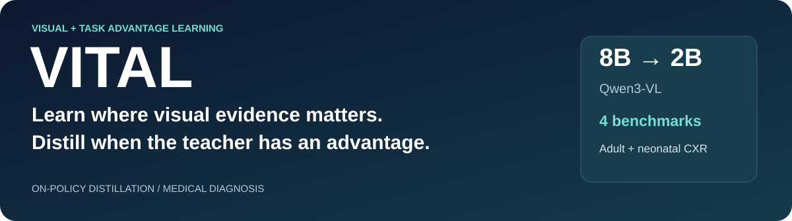
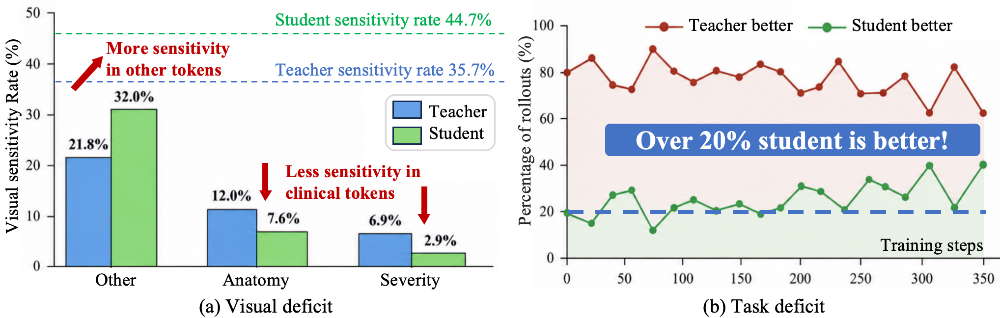
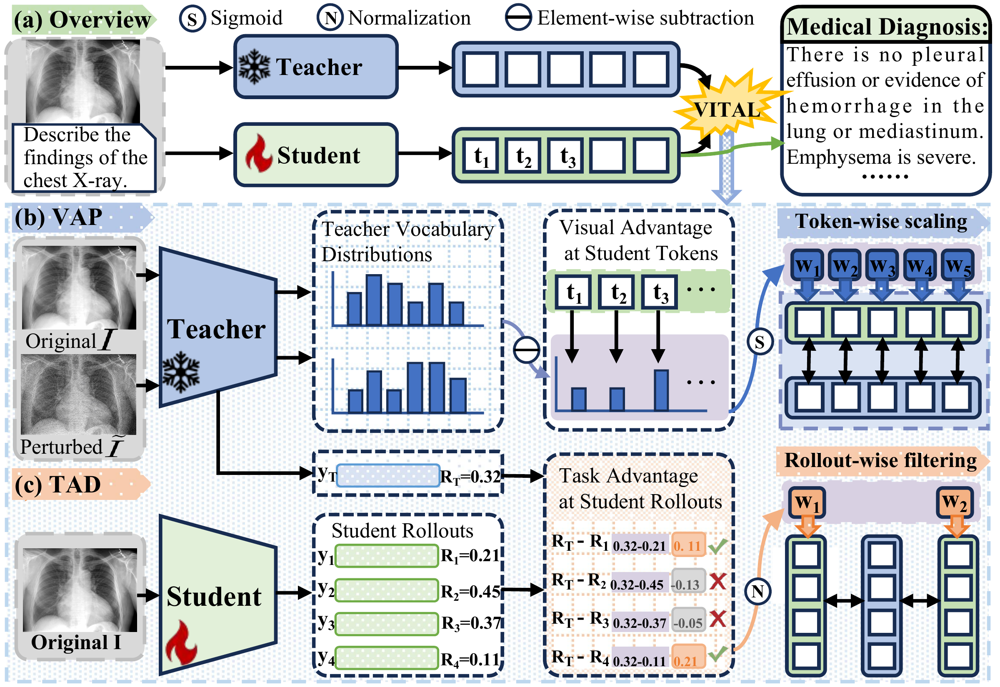
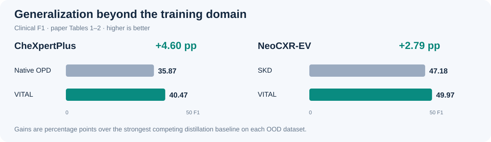
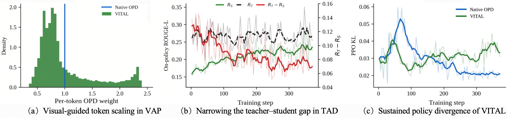
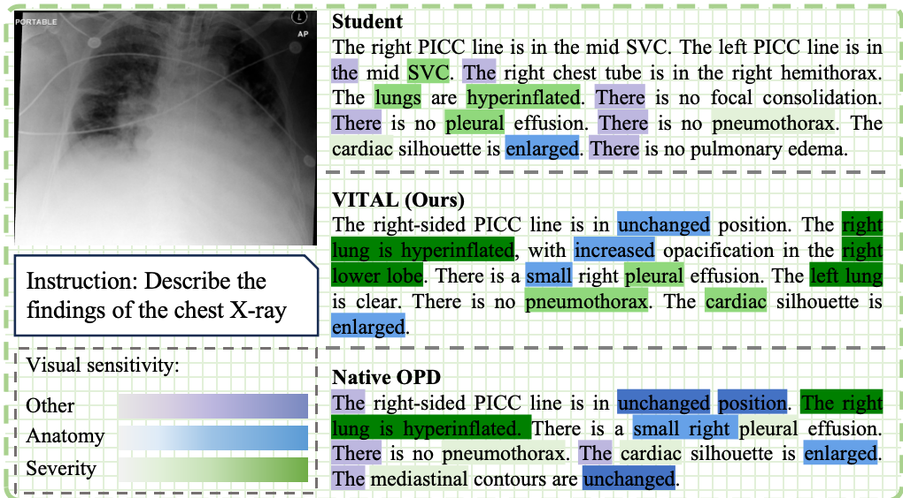
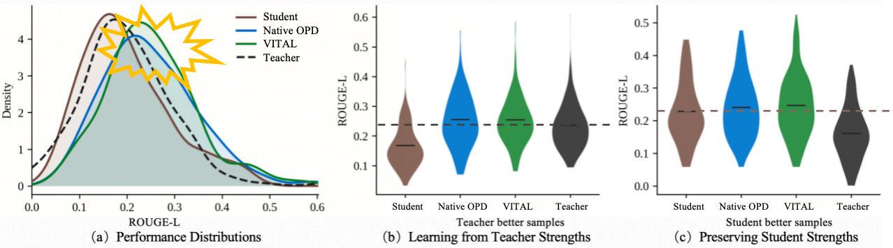
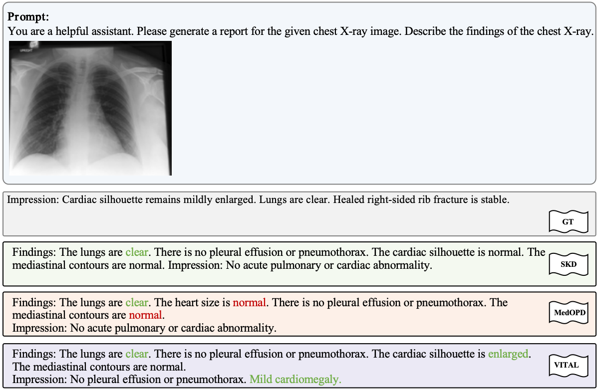
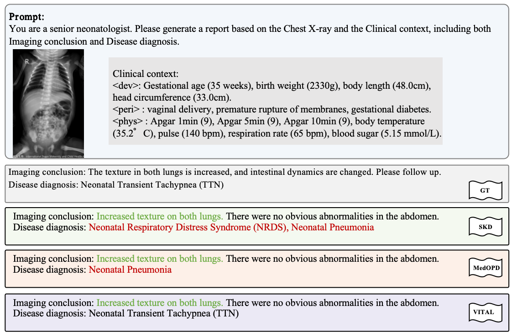

<p align="center">
  
</p>

<h1 align="center">VITAL: Visual and Task Advantage Learning<br>for On-Policy Distillation in Medical Diagnosis</h1>

<p align="center">
  <strong>Learning where to look and when to learn from the teacher.</strong><br>
  Anonymous authors · Under review as a conference paper at ICLR 2027
</p>

<p align="center">
  
  
  
</p>

<p align="center">
  <a href="#overview">Overview</a> · <a href="#method">Method</a> · <a href="#results">Results</a> · <a href="#getting-started">Getting started</a> · <a href="#citation">Citation</a>
</p>

> **VITAL learns where to rely on visual evidence and when to learn from the teacher:** VAP scales token-level policy updates by teacher visual sensitivity; TAD applies a separate distillation term only where the teacher has positive task advantage.

## Overview

A smaller model does not simply need *more* teacher supervision. Its visual dependence can be misplaced, and its own responses can already outperform the teacher. VITAL addresses these two deficits in on-policy distillation for adult and neonatal chest X-ray diagnosis.

<p align="center">
  
</p>

- **Visual deficit:** sensitivity to image changes is not necessarily concentrated on clinically meaningful anatomy and severity.
- **Task deficit:** teacher superiority varies across student rollouts; indiscriminate imitation can overwrite useful student behavior.
- **Complementary guidance:** a frozen 8B teacher supervises a 2B student on its own sampled reports, combining visual grounding with selective task guidance.

## Method

<p align="center">
  <a href="docs/assets/framework.pdf"></a><br>
  <sub>Figure 2 from the supplied paper source. Click for the vector PDF.</sub>
</p>

| Component | Signal | How it changes learning |
| :--- | :--- | :--- |
| **VAP · Visual Advantage Policy Optimization** | Teacher log-probability change between clean and Gaussian-perturbed images, on the same student prefixes | Z-score, sigmoid, and unit-mean normalization produce token weights that scale the policy advantage. |
| **TAD · Task Advantage Distillation** | Positive teacher-minus-student ROUGE-L gap against the same reference | Normalize positive gaps over accepted rollouts; weight a separate nonnegative distillation loss. Zero or negative gaps receive no TAD loss. |

<p align="center"><strong>L<sub>VITAL</sub> = L<sub>VAP</sub> + α L<sub>TAD</sub></strong></p>

The default recipe uses **4 rollouts per prompt**, **α = 2**, image-noise **σ = 0.10**, and sigmoid temperature **τ = 0.5**. TAD weights do **not** multiply VAP advantages: VAP remains active even when a rollout receives zero TAD weight. The launcher also zeros the TAD weight for repetitive copy loops. See the [configuration and implementation notes](docs/REPRODUCIBILITY.md).

## Results

<p align="center">
  
</p>

**Out-of-domain clinical F1**, as reported in paper Tables 1–2. Gains are absolute percentage points over the strongest competing distillation baseline on each dataset.

| Model | CheXpertPlus · adult OOD | NeoCXR-EV · neonatal OOD |
| :--- | ---: | ---: |
| 8B teacher | 38.51 | 54.79 |
| 2B cold-start student | 37.55 | 2.30 |
| Native OPD | 35.87 | 46.59 |
| MedOPD | 34.43 | 42.93 |
| SKD | 35.03 | 47.18 |
| **VITAL · 2B** | **40.47** | **49.97** |
| **Gain over best competing OPD** | **+4.60 pp** | **+2.79 pp** |

VITAL also obtains the highest **in-domain average** among the compared 2B methods: **36.16** on MIMIC-CXR and **52.05** on NeoCXR. It does not lead every individual metric.

<details>
<summary><strong>In-domain results and metric definitions</strong></summary>

| Model | MIMIC-CXR F1 | MIMIC-CXR Avg. | NeoCXR F1 | NeoCXR Avg. |
| :--- | ---: | ---: | ---: | ---: |
| 8B teacher | 46.40 | 39.57 | 66.65 | 64.57 |
| 2B cold-start student | 29.17 | 27.93 | 5.67 | 18.91 |
| Native OPD | 41.25 | 36.07 | 55.04 | 51.41 |
| MedOPD | 34.03 | 30.98 | **55.33** | 51.94 |
| SKD | 39.96 | 35.10 | 54.87 | 51.91 |
| **VITAL · 2B** | **41.37** | **36.16** | 55.19 | **52.05** |

Bold compares the 2B distillation methods. Paper Avg. is the mean of seven displayed metrics: ROUGE-L, ROUGE-1, METEOR, RaTE, precision, recall, and F1. BLEU-1 and BLEU-2 are not included in Avg. Adult clinical metrics use CheXbert; neonatal metrics use diagnosis extraction. See [metrics](docs/METRICS.md) and [source notes](docs/README_SOURCES.md) for evaluation details and figure provenance.

</details>

## Inside VITAL

<p align="center">
  
</p>

**Training dynamics.** VAP redistributes token weights, while TAD tracks the teacher–student reward gap. The paper reports greater late-stage policy divergence than Native OPD, consistent with selective imitation.

<details>
<summary><strong>Visual dependence and preservation of student strengths</strong></summary>

<p align="center">
  
</p>

VITAL concentrates visual sensitivity on clinically meaningful anatomy and severity expressions. These are visual-dependence visualizations, not region-level attention maps.

<p align="center">
  
</p>

ROUGE-L analysis from paper Figure 6 illustrates learning from teacher strengths while preserving student strengths.

</details>

<details>
<summary><strong>Qualitative examples · adult and neonatal OOD</strong></summary>

<p align="center">
  
</p>

**CheXpertPlus:** VITAL identifies mild cardiomegaly in this example.

<p align="center">
  
</p>

**NeoCXR-EV:** VITAL identifies transient tachypnea of the newborn (TTN). These are selected examples from the paper, not aggregate performance estimates.

</details>

## Getting started

**Release scope:** this checkout includes training/evaluation launchers, the modified `verl` tree, and data split lists. Images, trained checkpoints, prepared parquet files, and MedEvalKit are not included.

> **Runtime requirement:** the bundled compiled loss implementation requires CPython 3.12. Training also requires external data, models, and a compatible GPU environment. The commands below document existing entry points; they are not a verified end-to-end reproduction recipe.

### Installation

Use a Linux/CUDA environment with **CPython 3.12**, compatible PyTorch, vLLM and FSDP dependencies. Within the prepared environment, install the bundled package from the repository root:

```bash
python -m pip install -e './verl[vllm]'
```

This installs the declared package dependencies; it does not recreate the original GPU environment. The launchers activate a Conda environment named `verl` and require a local CuPy 13.6.0 directory. See [environment preparation](docs/REPRODUCIBILITY.md#environment-and-required-inputs).

### Training

After preparing the required inputs and compatible runtime, run from the repository root. Replace `/path/to/…` with your local files:

```bash
export CONDA_SH=/path/to/miniconda3/etc/profile.d/conda.sh
export CONDA_NAME=verl
export CUPY_PREFIX=/path/to/cupy-cuda12x-13.6.0
export STUDENT_MODEL=/path/to/2b_sft_merged_hf
export TEACHER_MODEL=/path/to/8b_gspo_actor_merged_hf
export TRAIN_FILE=/path/to/train_grpo_teacher_rougel.parquet
export TEST_FILE=/path/to/val_grpo.parquet
mkdir -p outputs/slurm_logs
bash scripts/sbatch_opd_k1only_n4_tvis_sigmoid_gapkl_a800.sh
```

The default allocation is **4 GPUs: 2 training + 1 rollout + 1 teacher**. For Slurm, adapt the cluster-specific `#SBATCH` directives, then submit the same script with `sbatch`. [Data preparation and splits](docs/DATA_SPLITS.md) · [Ablations and configuration](docs/REPRODUCIBILITY.md#ablations)

### Evaluation

The evaluation wrappers require an external MedEvalKit checkout with the exact scripts they call, prepared datasets, metric weights, and separate generation/metrics environments. With those available:

```bash
export CONDA_SH=/path/to/miniconda3/etc/profile.d/conda.sh
export MEDEVALKIT_ROOT=/path/to/MedEvalKit
export CONDA_NAME_EVAL=qwencomp
export CONDA_NAME_METRICS=medevalkit
export MODEL_PATH=/path/to/actor_merged_hf
export OUTPUT_PATH="$PWD/outputs/eval/mimic"
bash scripts/sbatch_eval_mimic_hf_model_l40.sh
```

| Evaluation | Existing entry point |
| :--- | :--- |
| MIMIC-CXR | [MIMIC HF evaluation](scripts/sbatch_eval_mimic_hf_model_l40.sh) |
| CheXpertPlus impression subset | [CheXpert evaluation](scripts/sbatch_eval_chexpert_rrg_impression_l40.sh) |
| NeoCXR and NeoCXR-EV | [Neonatal evaluation](scripts/sbatch_eval_mimic_model_on_neocxr_ev_l40.sh) |

See [evaluation setup and wrapper caveats](docs/REPRODUCIBILITY.md#evaluation) and [metric definitions](docs/METRICS.md). The neonatal wrapper runs **both** datasets; it is not a one-dataset selector.

## Repository guide

| Path | Contents |
| :--- | :--- |
| [`scripts/`](scripts/) | MIMIC preprocessing, OPD/ablation launchers, evaluation wrappers |
| [`verl/`](verl/) | Bundled training framework and VITAL weighting implementations |
| [`data/splits/`](data/splits/) | Sample lists; no images or model weights |
| [`docs/`](docs/) | Data, metrics, reproduction requirements, and figure provenance |

## Citation

The supplied manuscript is anonymous and under double-blind review at ICLR 2027. This is a provisional citation, not an acceptance announcement; no public paper URL or author identities are supplied here.

```bibtex
@unpublished{anonymous2027vital,
  title = {VITAL: Visual and Task Advantage Learning for On-Policy
           Distillation in Medical Diagnosis},
  author = {Anonymous Authors},
  note = {Under review as a conference paper at ICLR 2027}
}
```

## Acknowledgements

This implementation builds on the bundled [verl](verl/README.md) framework and Qwen3-VL models. Evaluation uses MedEvalKit, CheXbert and RaTEScore. We acknowledge the MIMIC-CXR, CheXpertPlus, NeoCXR and NeoCXR-EV datasets used in the paper. Upstream notices are retained in [`verl/Notice.txt`](verl/Notice.txt).

Names, affiliations, and contact details in upstream package metadata, copyright notices, and citations identify third-party contributors; they do not identify the anonymous authors of VITAL.

## License

The bundled `verl` framework carries an [Apache-2.0 license](verl/LICENSE). This checkout has no separate top-level license for the VITAL-specific additions or paper figures; the upstream license should not be interpreted as granting rights to every repository asset. Dataset and model terms remain those of their respective providers.
